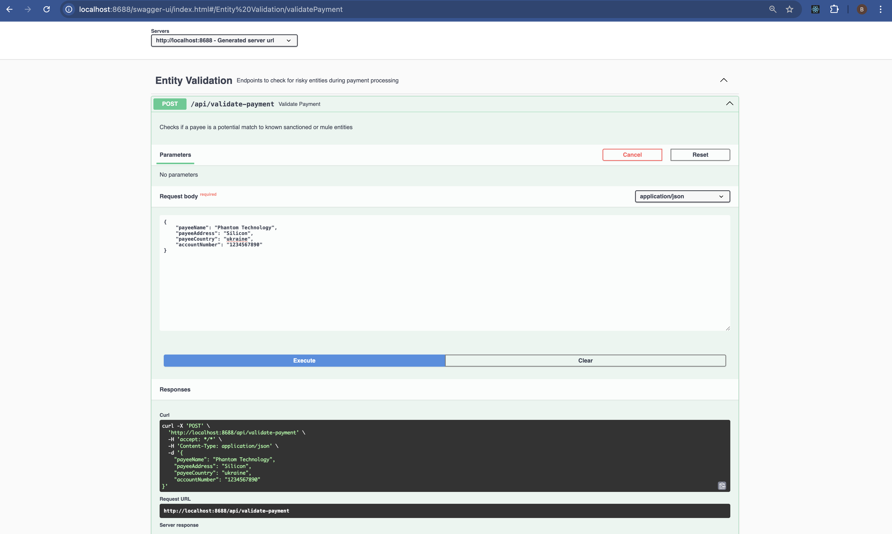
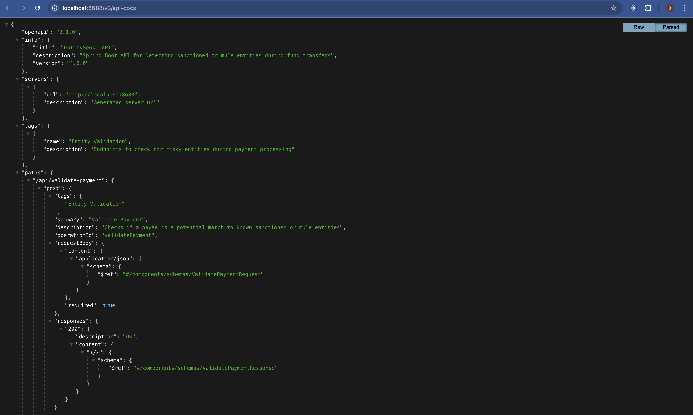
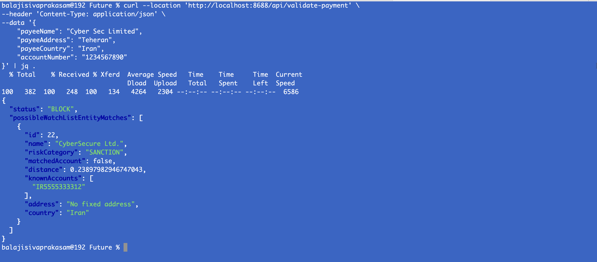

# EntitySense

A Spring Boot 3.5.4 application that uses vector similarity search (via `pgvector` + `Ollama`) to detect potential **sanctioned**, **mule**, or other **high-risk entities** during payment processing.

---

## Tech Stack

| Tool               | Purpose                                  |
|--------------------|------------------------------------------|
| Java 21            | Application runtime                      |
| Spring Boot 3.5.4  | Web backend framework                    |
| PostgreSQL 17.5+   | Database with pgvector extension         |
| pgvector           | Vector storage and similarity search     |
| Ollama             | Local embedding model (`nomic-embed-text`) |
| Swagger (SpringDoc)| API documentation                       |
| WebClient          | HTTP client for embedding requests       |

---

## Features

- REST API to validate a payee against known high-risk entities
- Uses vector embeddings + cosine similarity for fuzzy matching
- Risk categories supported:
  - `SANCTION`, `MULE`, `MONEY_LAUNDERING`, `CYBER_THREAT`, `SHELL_ENTITY`, `PEP`, `SCAM_ENTITY`
- Ollama integration for real-time embedding generation
- Swagger UI for API exploration

---

## API Endpoints

| Endpoint                       | Method | Description                                                  |
|--------------------------------|--------|--------------------------------------------------------------|
| `/api/validate-payment`        | POST   | Validates if a payee is a potential match to watchlist entities |
| `/api/create-watch-list-entity` | POST   | Adds a new high-risk entity to the database                 |

> 🔍 Swagger UI: [http://localhost:8688/swagger-ui/index.html](http://localhost:8688/swagger-ui/index.html)

---

## Prerequisites

| Tool     | Setup |
|----------|-------|
| PostgreSQL 17.5+ | `brew install postgresql@17` |
| pgvector         | `brew install pgvector` |
| Ollama           | `curl -fsSL https://ollama.com/install.sh | sh` |
| Java 21          | Ensure `JAVA_HOME` is set |
| Maven 3.9+       | Use IntelliJ or CLI |
| DBeaver (Optional) | For DB inspection |
| Postman / curl (Optional) | For testing APIs |

---

## Database Setup

```sql

-- Connect to Postgres instance
psql postgres

-- Create a dedicated DB user for the app - Replace ENTITY_PASSWORD_TO_BE_USED with your actual Password
CREATE USER entityadmin WITH ENCRYPTED PASSWORD '<<ENTITY_PASSWORD_TO_BE_USED>>';

-- Allow the user to create databases
ALTER ROLE entityadmin CREATEDB;

-- Create the actual app database
CREATE DATABASE entitydb OWNER entityadmin;

-- Grant full rights to the app user
GRANT ALL PRIVILEGES ON DATABASE entitydb TO entityadmin;

-- Check user privileges
\du

-- Connect to the app DB
\c entitydb

-- Enable pgvector extension (required for vector storage & similarity search)
CREATE EXTENSION IF NOT EXISTS vector;

-- Create a dedicated schema for app isolation
CREATE SCHEMA IF NOT EXISTS entitysenseschema AUTHORIZATION entityadmin;

-- Assign schema ownership to our app user
ALTER SCHEMA entitysenseschema OWNER TO entityadmin;

-- Allow user to use and create in schema
GRANT USAGE, SELECT, INSERT, UPDATE, DELETE ON entitysenseschema TO entityadmin;

-- =============================
-- Watchlist Entities Table
-- =============================
-- Stores high-risk entities including sanctioned, mule, laundering, etc.
CREATE TABLE entitysenseschema.watchlist_entities (
  id BIGINT GENERATED BY DEFAULT AS IDENTITY PRIMARY KEY,
  
  -- Basic entity details
  name TEXT NOT NULL,
  address TEXT,
  country TEXT,
  
  -- Optional array of known account numbers linked to this entity
  known_accounts TEXT[],
  
  -- Categorical risk tag (enum-style enforcement)
  risk_category TEXT NOT NULl CHECK (
    risk_category IN (
      'SANCTION', 'MULE', 'MONEY_LAUNDERING',
      'CYBER_THREAT', 'SHELL_ENTITY', 'PEP', 'SCAM_ENTITY'
    )
  ),

  -- 768-dimension embedding vector generated from entity info
  embedding VECTOR(768),

  -- Timestamp of when entity was added
  created_at TIMESTAMP DEFAULT now()
);

-- =============================
-- Vector Index (HNSW with Cosine Distance)
-- =============================
-- Enables fast approximate similarity search over 768-dimensional embeddings using
-- HNSW (Hierarchical Navigable Small World) indexing. This index uses cosine distance
-- — matching the cosine-based comparison logic in the EntitySense Java code.
-- Ideal for near real-time semantic similarity matching in high-volume datasets.
CREATE INDEX idx_watchlist_embedding_hnsw
  ON entitysenseschema.watchlist_entities
  USING hnsw (embedding vector_cosine_ops)
  WITH (m = 16, ef_construction = 200);

```

---

## How It Works

1. User submits payee info to `/validate-payment`
2. Spring Boot app sends text to Ollama (`nomic-embed-text`) to get a 768-dim vector
3. Vector is compared with existing watchlist vectors in PostgreSQL using `pgvector`
4. Cosine similarity is computed and the response includes:
   - `possibleSanctionEntityMatches`
   - `status`: `BLOCK` or `ALLOW`

---

## Use Cases

- Prevent fund transfers to risky accounts
- Comply with sanctions regulations (OFAC, UN, EU)
- Stop mule-related fraud and laundering networks
- Enhance KYC/AML checks with vector intelligence

---

## Run Locally

```bash
git clone https://github.com/sivabalaji1986/entity-sense.git
cd entity-sense

# Pull embedding model
ollama pull nomic-embed-text

# Start the app (pass the DB Password as VM Argument)
mvn spring-boot:run -Dentity_db_password=<<ENTITY_PASSWORD_TO_BE_USED>>
```

### Access Swagger at: [http://localhost:8688/swagger-ui/index.html](http://localhost:8688/swagger-ui/index.html)


### Access OpenAPI Spec at: [http://localhost:8688/v3/api-docs](http://localhost:8688/v3/api-docs)


### Access Actuator at: [http://localhost:8688/actuator/health](http://localhost:8688/actuator/health)

## Seed Data

I have provided a convenient HTTP file, `Sample‑WatchList.http`, that contains 20 `POST /api/create‑watch‑list‑entity` requests to populate your watchlist with all risk categories.

### With IntelliJ HTTP Client

1. Make sure you’re running the app:  
   ```bash
   mvn spring-boot:run -Dentity_db_password=<YOUR_DB_PASSWORD>
   ```

2. In IntelliJ, open the Sample‑WatchList.http file (its under resources/APITesting).

3. Click the ▶️ gutter icon next to “### 1) SANCTION: Global Arms Inc” (or any individual request) to run it, or right‑click in the editor and choose “Run All Requests” to execute all 20 in sequence.

4. You should see 200 OK for each. Your database is now seeded.

Once complete, you can verify entries in the DB or simply call:
```bash
curl --location 'http://localhost:8688/api/validate-payment' \
--header 'Content-Type: application/json' \
--data '{
    "payeeName": "Phantom Technology",
    "payeeAddress": "Silicon",
    "payeeCountry": "ukraine",
    "accountNumber": "1234567890"
}'
```



---

# Happy coding!
